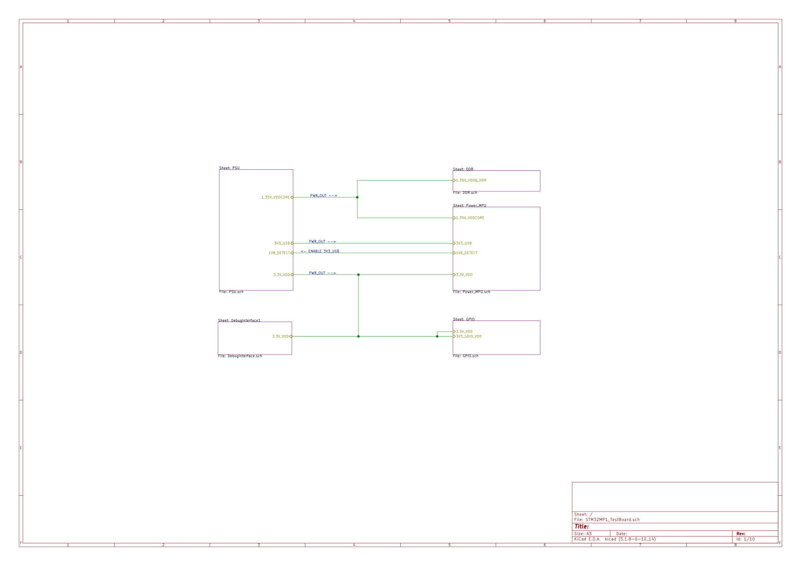
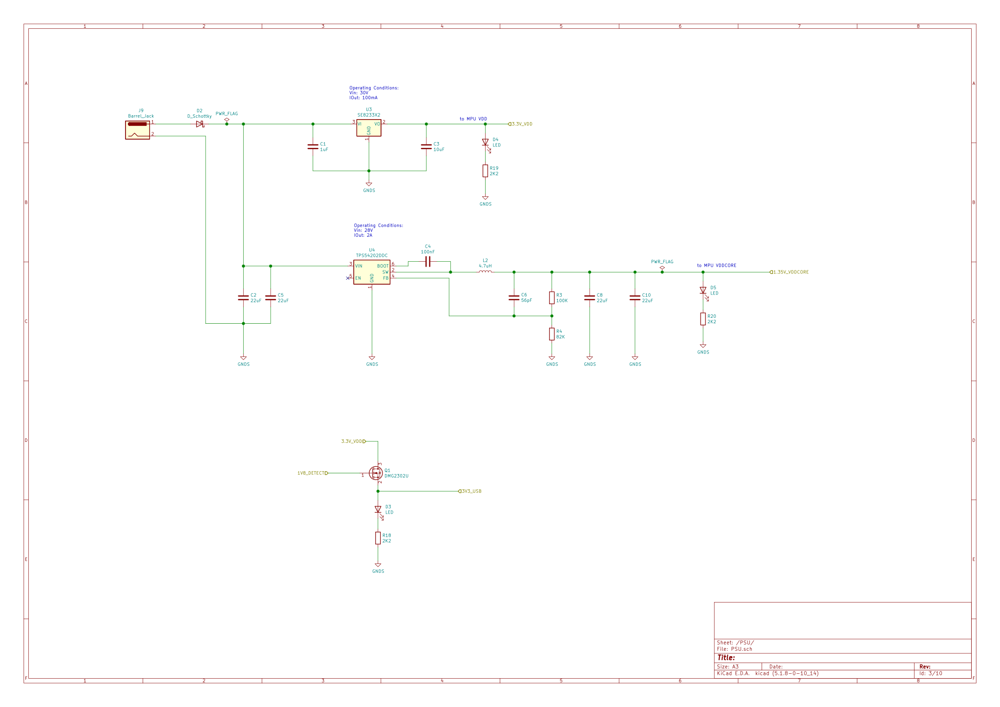
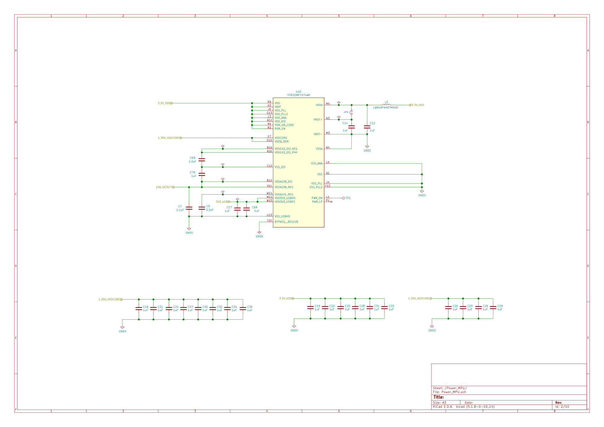
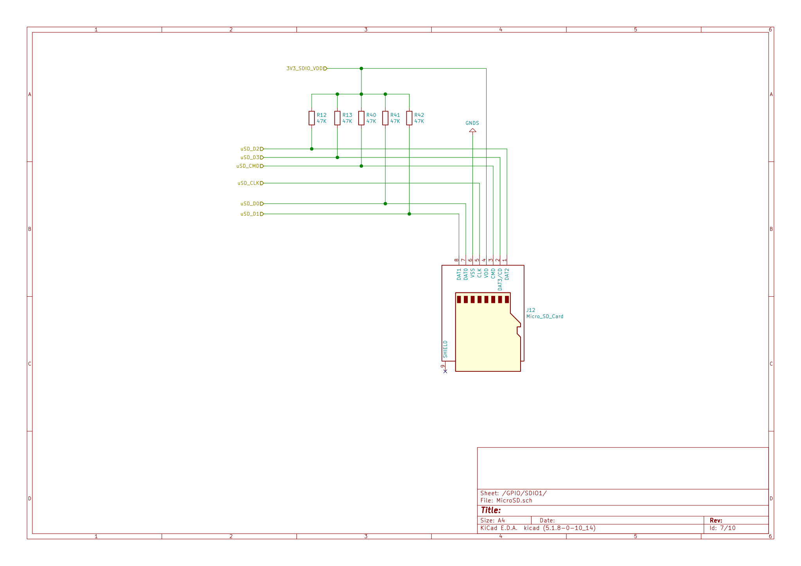

### STM32MP1 Embedded Linux breakout board ###

[Bill of materials](STM32MP1_TestBoard/doc/bom/STM32MP1_TestBoard.csv)

[DataSheets](STM32MP1_TestBoard/doc/datasheets)

#### System Overview ####

#### Power Supply ####

#### MPU Power Supply ####

#### MPU DDR ####

#### MicroSD connectors ####

#### USB Connectors ####

